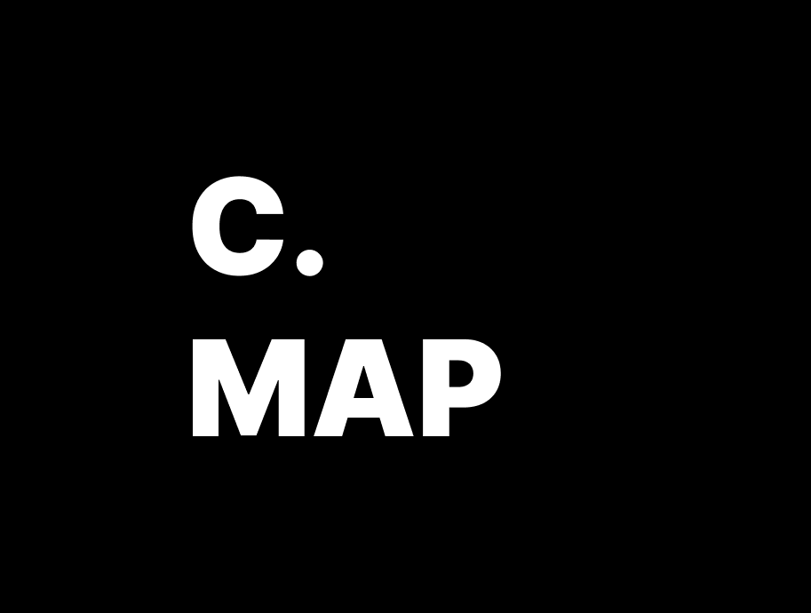

## my roadmap for learning C
i currently make a decision to bring my stupid brain into the low level programming and stuff. so i decided to learn C first. here u can find any resources and stuff for learning C and low level stuff

## books
first i wanna show my listing books for `learning C`. here you are some starter books:
- Effective C: An Introduction to Professional C Programming
- C in nutshell 
- The c programming language 2nd edition 

## What you will get from this repo
in this repo i share everything step by step from my learning and roaadmap which i am taking. u will see that i share even some resources for just a little word which is mentioned by the books. so this is a real deep deep diving into C programming language which needs a strong motivation only if you are interested like me in low level programming.